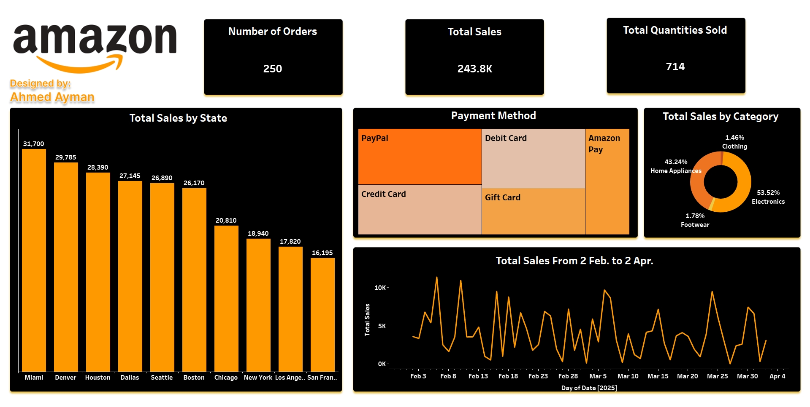
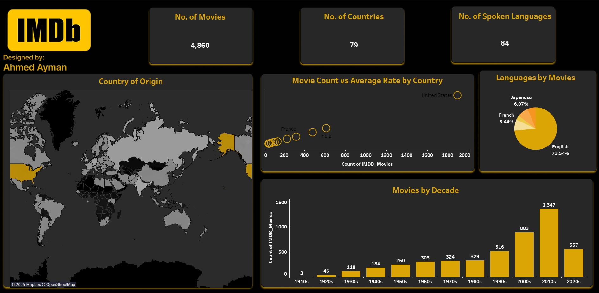
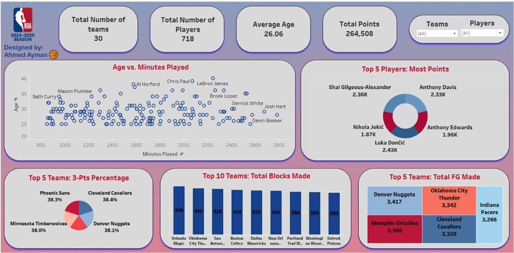
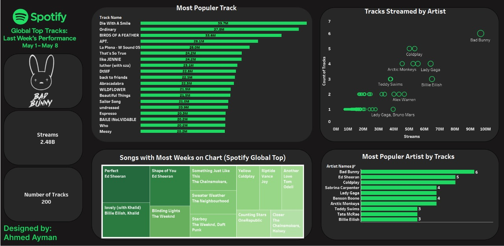

# Tableau Projects Portfolio

Welcome to my Tableau projects repository! This collection showcases my data visualization and business intelligence skills developed using **Tableau Desktop** during my journey at **ITI (Information Technology Institute)** from March 2025 to July 2025.

My aim is to transform complex datasets into interactive, insightful dashboards and reports that empower data-driven decision-making.

---

## Skills Demonstrated

* **Data Connection & Preparation:** Connecting to various data sources (Excel, CSV), data blending, and cleaning.
* **Calculated Fields & Parameters:** Creating complex calculations, level of detail (LOD) expressions, and interactive parameters.
* **Advanced Visualizations:** Designing a wide range of chart types (e.g., bar charts, line charts, scatter plots, maps, treemaps, custom visualizations).
* **Dashboard Design & Interactivity:** Building compelling, user-friendly dashboards with filters, actions, and story points.
* **Storytelling with Data:** Presenting insights clearly and effectively through visual narratives.

---

## Projects Overview

Below is an overview of the Tableau projects included in this repository:

### 1. Amazon Sales Analysis

* **Description:** An in-depth analysis of Amazon sales data to identify trends, top-selling products, customer purchasing patterns, and regional performance.

### 2. Bank Customers Analysis

* **Description:** This project focuses on analyzing bank customer data to understand customer demographics, service usage, and churn indicators.

### 3. IMDB Top250 Movies Analysis

* **Description:** An exploration of the IMDB Top 250 movies dataset, visualizing trends in movie ratings, genres, directors, and release years over time.

### 4. NBA Analysis

* **Description:** Analysis of NBA (National Basketball Association) player or team statistics to visualize performance trends, player comparisons, and game outcomes.

### 5. Sales Analysis

* **Description:** A general sales performance dashboard visualizing various sales metrics such as revenue, profit

### 6. Spotify Analysis

* **Description:** This project analyzes Spotify listening data or artist/track characteristics to uncover music trends, genre popularity, and user listening habits.

----
## Contact

Feel free to connect with me on [LinkedIn](https://www.linkedin.com/in/ahmedayman99/) or reach out via email at [ahmedayman1077@gmail.com](mailto:ahmedayman1077@gmail.com).
